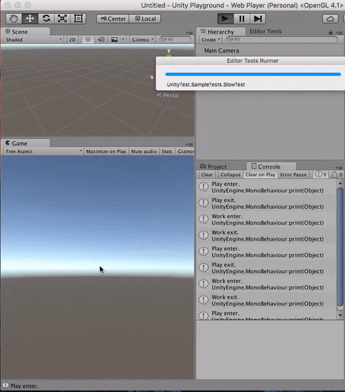

#State Machine

State Machine is a great way to make your program simpler. Here's a really simple example that uses Prime 31's [StateKit](https://github.com/prime31/StateKit) to achieve state machine.
 
